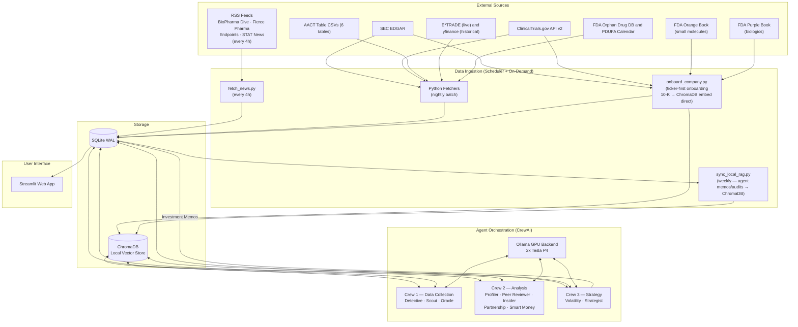

# Biotech-Analyzer v3.5 - System Architecture

**Version:** 3.5s
**Last Updated:** 2026-04-12
**Aligned with:** PRD v3.5z, DATAFLOW.md v3.5z, CREWAI_TOOLS.md v2.2

## Overview
Biotech-Analyzer v3.5 is a streamlined, AI-driven investment platform designed for maximum leverage and minimal complexity. It transitions from a complex, script-heavy desktop application to a containerized, web-based system powered by **CrewAI**, **ChromaDB (local vector store)**, and **Streamlit**.

## Core Philosophy: Maximum Leverage, Minimum Complexity
The system leverages existing polished tools rather than reinventing the wheel:
1. **Ollama:** Local GPU inference (2x Tesla P4s) for AI Agents (llama3.1:8b, llama3.2:3b, deepseek-r1:7b-q4_K_M).
2. **ChromaDB:** Self-hosted persistent vector store for semantic search over SEC filings, trial protocols, and agent memos.
3. **CrewAI:** Orchestration framework for agentic workflows.
4. **Streamlit:** Python-native web dashboard for visualizing data and agent outputs.
5. **SQLite (WAL):** A robust, single-file database for transactional data.

## System Components

### 1. Data Ingestion Layer
*   **Purpose:** Fetching raw financial and clinical data.
*   **Sources:** Hybrid financial data model balancing **E*TRADE** (requires frequent OAuth1 re-auth, highly reliable fresh data like live options chains; reference implementation in `scripts/EtradePythonClient/` — accounts, market quotes, order management) and **yfinance** (historical prices, stale EPS/fundamentals, rate-limited). Also uses ClinicalTrials.gov API v2 (real-time per-trial lookups), AACT CSV bulk download (6 tables, nightly), SEC EDGAR (10-K/10-Q/8-K/Form 4/13G/13D filings), FDA Orange Book (small molecule patent/exclusivity), FDA Purple Book (biologics BLA/exclusivity), and RSS feeds from 4 biotech news outlets (BioPharma Dive, Fierce Pharma, Endpoints News, STAT News — every 4h, no API key required).
*   **Default Watchlist:** `data/companies.csv` — 1,391 pre-curated biotech/biopharma/medical device tickers (Symbol, Company Name) loaded at system startup. Scheduler queues bulk onboarding via `onboard_company.py` for each `PENDING` ticker; `data/gbd_2019_clean.csv` provides GBD 2019 prevalence data for Scout's Tier 2 disease context fallback; `data/endpoint_synonyms.csv` normalizes free-text AACT endpoint strings for Peer Reviewer analysis (REQ-075).
*   **Mechanism:** Python scripts executed by a Dockerized APScheduler. `fetch_news.py` runs every 4h independently. Nightly scripts: `fetch_market_data.py`, `fetch_aact_csvs.py`, `fetch_sec_filings.py`, `fetch_options.py`, `fetch_clinical_trials.py` (on-demand CT.gov API v2 wrapper for agents). Weekly: `fetch_fda_data.py` (PDUFA calendar + orphan DB refresh). Onboarding runs on-demand via `onboard_company.py`.
*   **Storage:** Data is normalized and stored directly in `biotech_tracker.db` (SQLite WAL). SEC filings and trial protocols are embedded into ChromaDB (local vector store) for semantic search.

### 2. The Agent Council (CrewAI)
*   **Purpose:** Analyzing the raw data to extract actionable investment intelligence.
*   **Roster (10 agents across 3 crews, reduced from 23 in v16.5):**
    *   **Crew 1 — Data Collection (Parallel):** Detective/001 (Entity Resolution), Scout/002 (IPO Watch + Disease Context), Oracle/008 (PDUFA + Catalyst Calendar).
    *   **Crew 2 — Analysis (Parallel, waits for Crew 1):** Profiler/003 (Company Intelligence), Peer Reviewer/004 (Scientific Validation), Insider/005 (Form 4 Insider Tracking), Partnership/010 (BD&L Intelligence), Smart Money/011 (13G/13D Institutional Tracking).
    *   **Crew 3 — Strategy (Sequential, waits for Crew 2):** Volatility/009 (CSP Strike Selection), Strategist/006 (Final Investment Memo + Kelly Sizing).
*   **Execution:** Agents are defined as CrewAI classes with shared tools (DatabaseQueryTool, LocalRAGTool, etc. — see CREWAI_TOOLS.md). Crews 1 and 2 use parallel execution; Crew 3 is sequential (Volatility feeds Strategist).

### 3. Knowledge Base (ChromaDB Local RAG)
*   **Purpose:** Semantic search, historical context, and deep document analysis without cloud dependencies.
*   **Integration:** Agents access ChromaDB via the shared `LocalRAGTool` class defined in CREWAI_TOOLS.md. Collections: `sec_filings` (10-K/10-Q/8-K text), `trial_protocols` (Phase 2/3 study protocols), `agent_memos` (historical investment memos for Strategist longitudinal context). Embeddings are generated locally via Ollama using `mxbai-embed-large:latest`. ChromaDB collections are initialized with `OllamaEmbeddingFunction(model="mxbai-embed-large:latest", url=OLLAMA_HOST)` — this model must be pulled on the Ollama instance before first use. This architecture completely bypasses arbitrary word/size limits associated with notebook UI wrappers.
*   **Workflow:** When the Strategist Agent needs to know "What were the partnership terms for similar-stage biotech companies in 2023?", it queries ChromaDB via the RAG tool instead of executing complex SQL joins.

### 4. User Interface (Streamlit)
*   **Purpose:** A single-page web dashboard replacing the legacy CustomTkinter app.
*   **Features:**
    *   Portfolio Dashboard (Performance, Sharpe Ratio, Drawdown).
    *   Holdings Table and Active Signals.
    *   Interactive Agent Reports (Click a ticker to see the Strategist's memo).
    *   Direct natural language queries to ChromaDB (select collection: `sec_filings`, `agent_memos`, `trial_protocols`).
    *   News Feed — latest `news_articles` with category filter (m&a, fda, conference, partnership, analyst).

## Architecture Diagram (Logical Flow)



## Onboarding Pipeline (Ticker-First)

The onboarding pipeline is the entry point for adding a new company to the system. It runs once per ticker and re-runs automatically when a new 10-K is filed. It operates independently of the daily Crew 1–3 cycle.

```
New Ticker (user entry or Scout Task D post-IPO)
    │
    ▼
[Step 1] Validate ticker (yfinance)
    │
    ▼
[Step 2] Fetch latest 10-K from SEC EDGAR
         SECEdgarFetcherTool → raw text + URL → sec_filings table
    │
    ▼
[Step 3] Embed 10-K into ChromaDB (LocalRAGTool write mode)
         512-token overlapping chunks, local Ollama embeddings
         Partitioned by therapeutic area
    │
    ▼
[Step 4] LLM structured extraction (llama3.1:8b)
         Extracts: drug names, NCT IDs, pipeline phases, officers, board,
         revenue stage, patent cliff dates, top risks, cash/burn/runway
    │
    ▼
[Step 5] Upsert into SQLite
         companies (financial fields, onboarding_status = COMPLETE)
         interventions (drug names per ticker)
         company_onboarding_log (audit record)
    │
    ▼
[Step 6] Link clinical trials — four-pass approach
         Pass 1: NCT IDs cited verbatim in 10-K → direct CT.gov lookup (10K_CITED)
         Pass 2: Drug name search → CT.gov /api/v2/studies?query.term={drug_name} (DRUG_NAME_MATCH)
         Pass 3: Company name → CT.gov search by sponsor OR collaborator name (COMPANY_NAME_MATCH)
                 (captures trials where company is an industry collaborator, e.g., in a partnership)
         Pass 4: Detective entity_aliases lookup → resolved ticker → link all trials for that sponsor (ENTITY_RESOLVED)
                 (catches subsidiary/acquisition cases where sponsor name ≠ public company name)
         Priority: 10K_CITED > DRUG_NAME_MATCH > COMPANY_NAME_MATCH > ENTITY_RESOLVED
    │
    ▼
[Step 7] Drug database lookups
         FDA Orphan Drug DB → orphan table
         FDA Orange Book (small molecules) → interventions.orange_book_appl_no + patent_expiry
         FDA Purple Book (biologics) → interventions.purple_book_bla_no + patent_expiry
         Note: investigational drugs return NOT_FOUND — logged, does not block completion
```

**Design rationale:** Drug names (e.g., "lecanemab") and NCT IDs are stable identifiers that do not change due to M&A, subsidiary naming, or bankruptcy. Searching CT.gov by company name alone yielded a ~30% Zero Trial failure rate in legacy testing. The 10-K provides a legally mandated, authoritative inventory of all active pipeline assets with frequent NCT ID citations.

**Trigger conditions:**
- User adds ticker via Streamlit UI → Scout Task D triggers immediately
- Scout Task A (IPO detection) → Scout Task D triggers post-triage
- Daily scheduler (07:00): runs `onboard_company.py` for any ticker with `onboarding_status = PENDING` or `STALE`
- `fetch_sec_filings.py` detects new 10-K filing → sets `onboarding_status = STALE` for that ticker

## Deployment (Docker Compose)
The entire stack is orchestrated via a single `docker-compose.yml` file, ensuring identical environments between development and production (Dell R730 server).

*   **biotech-app:** Runs the Streamlit UI and exposes port 8501.
*   **ollama-gpu0 / ollama-gpu1:** Two dedicated instances managing model inference across the two Tesla P4s.
*   **chromadb:** Connects to the ChromaDB local vector store.
*   **scheduler:** Runs the daily ingestion and agent execution tasks.

## Security & Best Practices
*   **Environment Variables:** API keys (E*TRADE) are injected securely via `.env`.
*   **Volumes:** `biotech_tracker.db` and LLM models are mounted as persistent volumes outside the container lifecycle.
*   **Access Control:** The Streamlit dashboard runs on a local port, accessible only via secure VPN or reverse proxy (e.g., Nginx + OAuth).
